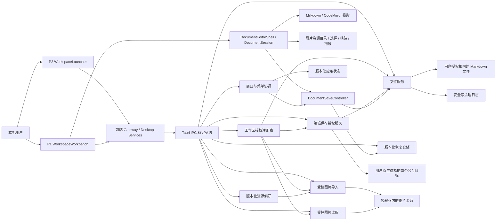

# Plainroot 桌面底座架构

## 1. 文档定位

本文描述 Plainroot 当前已经落地的桌面底座模块、数据流、权限边界和运行约束。产品范围与最终验收以 `../requirement.md` 为准，第一、二阶段任务状态与验证证据分别以 `../stage-1-desktop-foundation/plan.md`、`../stage-2-markdown-editing/plan.md` 为准；代码、清单、配置和自动化测试是实现事实源。

当前架构覆盖 P2 工作区启动页、P1 单文档编辑工作台、本地文件与窗口底座、单一 `DocumentSession`、统一编辑器壳、Milkdown 排版 adapter、CodeMirror 源码 adapter、生产 Markdown 兼容性解析、自动/手动保存控制器、恢复快照触发、恢复/冲突/另存可见流程、外部删除保护和窗口结算握手，以及资源目录偏好、受控图片导入、文档相对链接、缺失占位与重新定位、每窗口原生编辑菜单状态和持续文档状态栏。多页签、大纲、全文搜索、主题工作室和分页阅读仍未落地。

## 2. 总体结构

前端只表达页面状态和用户意图，不直接以绝对路径执行磁盘写入。Rust 命令层接收 `workspaceId` 与工作区相对路径，在每次 I/O 前重新校验授权根、规范化路径、符号链接和文件类型，再调用具体文件或窗口服务。

## 3. 模块职责

| 模块 | 主要路径 | 当前职责 | 明确边界 |
| --- | --- | --- | --- |
| 根应用与页面路由 | `src/App.tsx` | 根据当前窗口工作区快照在 P2 与 P1 间切换；根启动错误交给可恢复页面状态处理 | 不维护第二套同源错误面，不伪造工作区或编辑状态 |
| P2 工作区启动页 | `src/features/launcher/` | 文件夹/Markdown 选择、授权范围确认、最近记录、失效重授权、根窗口恢复、恢复快照入口和打开方式决策 | 不在启动页直接写恢复正文；先打开并授权对应工作区，由 P1 消费快照；不删除本地目录 |
| P1 单文档工作台 | `src/features/workbench/` | 渐进文件树、真实单文档排版/源码编辑、格式栏、持续文档状态栏、自动/手动保存、恢复/冲突/另存、受控图片资源、外部删除保护、当前文档查找、文件 CRUD、监听、工作区切换、原生菜单状态投影和窗口结算意图消费 | 不包含页签、大纲、工作区搜索或虚假磁盘成功状态 |
| 共享前端组件 | `src/components/` | `AppDialog`、`AsyncStatePanel` 与 `focusContainment` 统一对话框、状态优先级和焦点生命周期 | 页面业务状态保持在各自 feature；仅在第二个同职责消费者出现后抽取 |
| 统一编辑器壳与文档会话 | `src/features/editor/DocumentEditorShell.tsx`、`documentSession.ts`、`remarkMarkdownParser.ts` | P1 唯一正文与历史；切换前提交当前 Markdown/选择/锚点；源码回排版按 AST、尺寸与结构复杂度重评估；统一格式/history/find/image 命令、资源目录弹层、选择/粘贴/拖放编排和非颜色状态反馈 | 不直接保存磁盘、不持有第二份正文；陈旧解析、图片导入或保存结果不能改写新 session；磁盘与恢复生命周期由保存控制器消费 |
| 保存与恢复控制器 | `src/features/editor/save/DocumentSaveController.ts` | 以单一 session 为输入，按 UTF-8 尺寸分级调度自动保存和恢复快照；手动保存复用同一写入链；保存/快照分别单飞；保存中编辑追赶最终 revision；把 dirty/clean/conflict/content safety 投影为窗口结算结果 | 不直接拼绝对路径或另建写入实现；只有 Rust safe-write 成功才清洁 session；恢复快照不是磁盘提交；可见选择由 recovery 组件消费 |
| 恢复、冲突与另存交互 | `src/features/editor/recovery/` | 组合 `AppDialog`/`AsyncStatePanel` 展示内容安全、恢复元数据、冲突证据和目标状态；消费 recovery/save gateway 的一次性令牌；把成功结果提交回唯一 session | 不接收任意绝对目标路径、不自行写文件、不把恢复快照当历史版本；processing 期间禁止关闭，单项失败隔离 |
| 排版编辑 adapter | `src/features/editor/adapters/milkdown/` | 将 Milkdown CommonMark/GFM、选择/锚点、格式与结构命令、三态剪贴板载荷、受控图片节点、缺失占位/重新定位和性能门槛映射为统一 `EditorAdapter`；支持只读与异步销毁 | 不持有文件保存、跨模式内容或第二套权威撤销历史；图片只消费编辑器壳提供的受控解析与重新定位回调；超过 2 MiB 或 2000 个非空内容行时前置返回源码降级；由编辑器壳按需加载 |
| 源码编辑 adapter | `src/features/editor/adapters/codemirror/` | 将 CodeMirror Markdown、高亮、行号、括号匹配、当前文档查找替换、选择/滚动和只读映射为统一 `EditorAdapter`；原始文本投影把规范化编辑变更映射回 raw Markdown | 不持有文件保存、工作区搜索或第二套 history；CRLF/CR/mixed 未触及部分不得被内部 LF 视图静默归一；由编辑器壳按需加载 |
| 桌面契约与网关 | `src/services/desktop/` | Rust↔TypeScript 类型、错误码和 IPC 调用封装 | 不把原始系统堆栈或任意绝对路径暴露为前端操作能力 |
| 契约与非桌面回归门禁 | `src-tauri/src/contract_test.rs`、`src/features/editor/roundtripCorpus.test.ts`、`package.json` | 对每个 TypeScript 导出 interface、字符串枚举/标签登记 Rust parity 断言；用生产 Milkdown/CodeMirror adapter 验证 CommonMark/GFM、HTML 和 source-only 语料；统一执行 Node、Vitest 与 Rust 服务测试 | 不替代 Tauri IPC、系统输入法、原生选择器或双平台桌面 E2E；测试文件系统只使用隔离临时目录 |
| 隔离桌面回归 | `tests/e2e/specs/desktop-shell.e2e.mjs`、`tests/e2e/wdio.conf.mjs`、`tests/support/workspace-fixture.mjs` | 以独立状态目录和每套件临时复制工作区驱动真实 Tauri IPC；覆盖 P2/P1、两模式编辑、资源上传、保存重开、外部修改与恢复；确定性业务流程禁用 Mocha 重试 | E2E feature 与临时命令编译期隔离，生产前端和 release 二进制不得包含；WebView 文件事件不等于系统剪贴板/Finder 原生拖入，macOS 结果不外推 Windows |
| Rust 命令入口 | `src-tauri/src/commands/` | 对外暴露选择、授权、扫描、读取、CRUD、删除、监听和安全写命令 | 命令只接收受控标识与相对路径，磁盘成功后才返回可提交结果 |
| 文件系统服务 | `src-tauri/src/fs/` | 路径与身份、扫描、读取、变更、删除、监听、原子替换和安全写 | 默认不跟随根内符号链接；平台差异由适配层收口 |
| 窗口与菜单 | `src-tauri/src/window.rs`、`src-tauri/src/menu.rs` | 一目录一窗口、当前/新窗口决策、根会话协调、单实例转交、原生菜单、按窗口保存编辑菜单状态，以及系统关闭/菜单关闭/当前窗口根替换/应用退出的非阻塞结算意图 | 当前只结算每窗口一个文档，不承担页签集合门禁；coordinator mutex 不跨越前端等待；只有聚焦窗口真实 session 可消费的菜单项启用 |
| 版本化状态 | `src-tauri/src/state.rs` | 最近工作区与根窗口会话的原子持久化、损坏备份和未知版本保护 | 不保存 Markdown 正文、打开偏好、账号或远端状态 |
| 版本化恢复 | `src-tauri/src/editor/recovery.rs`、`commands/editor.rs`、`src/services/desktop/recovery.ts` | app data 内最新单文档快照、活动脏会话保护、锁外大正文 I/O、并发读取租约、期限/条目/容量清理、损坏隔离和 IPC/TS 契约；P1/P2 已提供受控查询和恢复入口 | 不替代工作区 `.md`；恢复只进入 dirty session；正文读取与删除必须匹配已授权 workspace、snapshot id 与相对路径 |
| 冲突覆盖与安全另存 | `src-tauri/src/editor/save_copy.rs`、`commands/editor.rs`、`src/services/desktop/editorSave.ts`、`src/features/editor/editorGateway.ts`、`src/features/editor/recovery/` | 生成冲突磁盘证据；签发绑定 workspace/path/revision/content hash 的一次性覆盖令牌；由 Rust 原生保存对话框签发单目标另存令牌；前端展示第二次确认和目标状态，成功后更新唯一 session | 令牌仅进程内、最多 32 项、5 分钟且确认即消费；前端不能提交绝对目标路径；工作区外目标不形成持久目录授权 |
| 资源偏好与图片导入 | `src-tauri/src/preferences.rs`、`src-tauri/src/editor/assets.rs`、`commands/editor.rs`、`src/services/desktop/assets.ts`、`src/features/editor/assets/`、`src/features/editor/adapters/milkdown/workspaceImageNodeView.ts` | 按工作区保存/读取/重置资源目录；以当前授权根重新校验目录；通过 raw IPC 或 Rust 原生选择器导入 PNG/JPEG/GIF/WebP，校验签名和 20 MiB 上限后原子写入不覆盖的唯一资源名；P1 将工作区资源路径转换为当前文档相对链接，承接选择、剪贴板、拖放、缺失占位、重新定位和移动后链接调整 | 偏好不包含正文；SVG 拒绝；原始图片不删除；上传/导入令牌仅进程内、最多 32 项、5 分钟且单次消费；插入成功后 confirm 保留，失败/取消只清理身份/hash 未变化的本次副本；预览读取仍由 Rust 重新授权、限制大小并校验签名 |

## 4. 核心运行不变量

### 4.1 授权与路径

- 用户必须先通过系统选择器选择文件夹或 Markdown 文件；选择单文件时，展示并确认其父目录工作区范围。
- `WorkspaceRegistry` 以规范化根目录建立授权身份；同一规范化目录只允许一个可写窗口映射。
- 所有文件命令都基于工作区相对路径执行根内校验，拒绝绝对路径、`..`、越界符号链接和不支持的文件类型。
- 正式 capability 只包含 `core:default`，前端没有 Dialog、Store 或通用文件系统权限；系统选择器由 Rust 侧驱动。

### 4.2 磁盘先于界面

- 新建、重命名、移动、删除和安全写入先完成磁盘操作，前端收到成功结果后再提交文件树或页面状态。
- 失败返回稳定 `DesktopError`，携带可重试性和内容安全信息；页面不得将失败显示为成功。
- 安全写在同目录创建随机临时文件，写入并同步后执行平台原子替换；替换前再次核验文件修订，避免静默覆盖外部修改。
- 冲突覆盖继续复用安全写双重 revision 校验；覆盖令牌还绑定当前编辑内容 hash，确认后内容变化或令牌重放都必须重新取得证据。
- 另存目标只能来自 Rust 原生保存对话框。本次目标被规范化为父目录身份、文件名和可选目标 revision 后写入一次性令牌；确认时再次核验，目标已存在必须提交显式覆盖意图，新目标使用 no-replace。
- 工作区源副本保留可验证的 UTF-8 BOM 与单一换行风格；mixed 或不支持编码必须明确选择 UTF-8 输出格式，全新无基线内容默认 UTF-8 + LF。
- 图片资源目录只能是授权根内的规范化相对目录，不能经过符号链接。资源先以私有随机临时文件写入并同步，再通过平台 no-replace 提交唯一名称；编辑器只能消费返回的相对路径，不能把任意绝对目标交给导入命令。
- 排版 adapter 只消费统一会话投影并发出带 generation/editVersion 的变更；Cmd/Ctrl+Z 与重做桥接会话 history，不启用 Milkdown 第二套权威历史。React 投影返回前的连续本地事务必须单调推进 adapter 内部 editVersion，同 generation 的较低版本投影不能覆盖更新的本地内容。富文本粘贴只保留可表达结构，主动内容、危险 URL 和外部图片不能绕过受控资源导入。
- 源码 adapter 与排版 adapter 使用同一 generation/editVersion 事务和 session history，并遵守相同的本地版本单调与陈旧投影拒绝规则。CodeMirror 内部文本模型以 LF 工作，raw 投影负责 raw/editor 选择偏移和变更反投影；这层边界是 CRLF、CR 与 mixed 文件可安全源码编辑的前提，不能用 `state.doc.toString()` 直接覆盖 session Markdown。
- 模式切换必须先同步读取当前 adapter 的 Markdown、选择和锚点并提交 `DocumentSession`，再卸载旧投影；源码回排版必须以当前 generation/editVersion 重新解析，晚到或陈旧结果只能被拒绝。只读限制正文写入，不限制选择、查找和不改变内容的模式投影。
- 排版可交互性同时受 UTF-8 字节数和非空内容行数约束；当前证据门槛为 `≤2 MiB 且 ≤2000 个非空内容行`，超出时在创建 Milkdown 前转源码模式。行数采用不拆分全文的流式计数，能覆盖没有空行分隔的紧凑列表和表格；该门槛是可复测的保守技术安全值，不是 Markdown 文件总上限。
- 自动保存按 UTF-8 字节数使用 800 ms/2 秒/5 秒防抖，恢复快照使用 2 秒或大正文 10 秒节流；保存与快照分别单飞并合并陈旧请求。保存期间的新编辑必须追赶到最新 `editVersion`，窗口结算必须等待追赶写结束；只有 Rust 原子提交返回的新 revision 才能清洁 session。
- 保存失败或恢复仓储降级时必须准确保留 `contentSafety`：内存正文、已持久恢复快照和磁盘 revision 不能混称。磁盘 `FileRevision.contentHash` 的稳定格式是 `sha256:<64 位十六进制>`，恢复快照内部正文摘要才是裸 64 位十六进制；两者必须分别校验，不能共用一个格式判定。成功保存后先释放活动快照保护再删除匹配快照；晚到的旧快照必须删除，不能把已保存 session 重新标成可恢复；已成功注册的同一活动会话在快照定时器触发时应复用注册状态，不能重复向仓储注册。
- 当前文档被外部删除时，watch 只把 session 转为 `save_failed/path_not_found`，不清空 Markdown。安全关闭要求恢复快照或同一 generation/editVersion 的另存结果覆盖当前内容；否则保持文档打开。
- 冲突覆盖重新获取最新证据并执行第二次确认；令牌过期、内容变化或磁盘再次变化都回到可重试状态。恢复快照载入只修改内存 session，另存目标只能由原生选择器的一次性令牌决定。
- 资源服务返回的 `assetPath` 是工作区相对路径；编辑器插入 Markdown 前必须根据当前文档所在目录转换为文档相对链接。根目录与多层子目录文档不能共用未经转换的链接文本。
- 图片落盘与 Markdown 插入是显式两阶段：落盘返回 import token，插入成功后确认保留，插入失败/取消时仅凭原生文件身份、长度与 SHA-256 清理本次未变化副本。强制进程终止可能在两阶段之间留下孤立资源，缺少持久证据时不得猜测删除。
- 图片预览不能直接使用前端拼接的文件 URL。前端先把当前文档相对链接解析为工作区相对路径，Rust 再以当前 workspace 授权、根内路径、普通文件、20 MiB 上限和签名白名单重新校验后返回原始字节；WebView 只为本次投影创建可撤销的 Blob URL。CSP 仅为图片增加 `blob:`，不增加前端文件系统 capability。
- 移动文档或包含图片的目录时，先完成磁盘移动，再以 Markdown AST 位置只重写受影响图片的 URL；重写结果进入原 `DocumentSession` dirty 状态，由同一自动保存/恢复链持久化。磁盘移动失败前不得改写正文。
- 文件监听把应用自身变化与外部变化分开归并，最终以磁盘重扫保持一致，不把平台事件序列当作跨平台契约。

### 4.3 窗口与状态事务

- 当前窗口有绑定文档时，系统关闭、菜单关闭和当前窗口根替换先创建一次性结算 intent 并交给前端当前 `DocumentSaveController`；只有允许结果才继续原窗口事务，拒绝、保存失败或失效 intent 均保留原窗口状态。
- 应用退出对所有已绑定工作区窗口创建同一组结算 intent；任一窗口拒绝即取消整组，全部允许后才设置退出 bypass。结算协调锁只保护意图登记与解析，不持有锁等待 WebView 回应。
- 当前窗口替换在结算通过后再完成窗口/工作区协调和持久状态提交，随后更新内存授权映射；失败时保留原窗口状态。
- 新窗口创建若后续持久化失败，会关闭未提交窗口并释放目标授权，不留下第二个可写映射。
- 最近记录或单个根会话恢复失败不得阻断其他记录和窗口；移除最近记录只修改辅助状态，不删除本地文件。

## 5. 数据、配置与权限

| 数据或配置 | 路径/来源 | 内容与上限 | 回退与安全边界 |
| --- | --- | --- | --- |
| Markdown 内容 | 用户授权工作区 | 真实 `.md` 文件，单次内联读取/写入上限 64 MiB | 不随应用版本回滚；失败保持原文件或明确报告内容安全性 |
| 应用状态 | 操作系统 `appDataDir()/plainroot-state-v1.json` | schema v1；最近工作区最多 100 条；文件上限 8 MiB | 损坏文件备份后回到安全默认；未知版本不覆盖；退出应用后可备份并删除 |
| 安全写清理日志 | `appDataDir()/plainroot-safe-write-cleanup-v1.json` | 最多 32 个待清理临时路径；日志上限 64 KiB | 只重试历史授权根内且重新校验通过的 Plainroot 临时文件；不可再授权条目不占全局预算 |
| 恢复快照 | `appDataDir()/plainroot-recovery-v1/` | schema v1；每文档最新一份；默认 7 天、32 项、正文总量 128 MiB；snapshot/manifest 为私有原子文件；大正文读写不持有全局 manifest 锁 | 活动脏会话最后快照不被自动清理；读取租约防止并发删除提前移走正文；容量/写入失败降级为仅内存安全且后续成功写可恢复；未知版本不覆盖；不读取或删除未授权工作区快照 |
| 资源目录偏好 | `appDataDir()/plainroot-preferences-v1.json` | schema v1；按 `workspaceId` 保存 `assetDirectory`；默认 `assets/`；文件上限 1 MiB、最多 1000 个工作区 | 私有临时文件 + 原子替换；写失败保留磁盘和内存旧值；损坏文件备份后回默认；未知版本不覆盖；删除该文件只恢复默认，不删除已导入资源 |
| 图片资源 | 用户授权工作区的当前 `assetDirectory` | PNG/JPEG/GIF/WebP；单项上限 20 MiB；唯一可读文件名；Markdown 使用按当前文档计算且仍解析在授权根内的相对链接 | 文件签名而非扩展名为准；SVG/伪造 MIME/超限拒绝；原始选择文件不删除；确认前取消只清理本次且未被外部修改的副本；预览 Blob URL 在节点更新/销毁时撤销 |
| 正式 Tauri 配置 | `src-tauri/tauri.conf.json`、`src-tauri/capabilities/default.json` | 开发 identifier、窗口尺寸、CSP 与最小 `core:default` capability | 不授予全 HOME 或前端通用文件权限；正式品牌身份与签名发布前另行确认 |
| E2E 配置 | `src-tauri/tauri.e2e.conf.json`、Cargo `e2e` feature | 独立 identifier、临时状态目录和 WebDriver 能力 | 编译期 feature 默认关闭，不进入正式依赖图、前端产物或生产二进制 |

当前没有 SQL、数据库 schema、seed、业务账号、密钥或产品运行所需环境变量。`PLAINROOT_E2E_DATA_DIR` 只存在于编译期隔离的 E2E 测试构建，用于每次测试的临时状态目录，不是生产配置。

## 6. 菜单与原生能力

- 已启用并有真实消费者：打开文件夹、打开 Markdown 文件、新建窗口、关闭窗口、保存、另存副本、撤销/重做、当前文档查找和排版/源码模式；关闭窗口事件统一进入当前文档结算门禁。
- Rust `EditorMenuStateRegistry` 按窗口记录 `hasDocument/readOnly/busy/canUndo/canRedo/mode`，仅把聚焦窗口状态应用到平台菜单；窗口聚焦时恢复、销毁时删除，P2 与无文档 P1 主动重置，避免后台窗口或旧页面污染全局菜单。
- 保存、另存、历史、查找和模式事件只发给聚焦工作台并进入 `DocumentEditorShell`/`DocumentSaveController` 的既有命令链。剪切、复制、粘贴和全选使用平台原生角色，不注册第二套 React 全局快捷键；工作区搜索、侧栏、阅读、页签和主题等后续命令保持禁用。
- Finder/Explorer 定位、系统回收站与永久删除都通过 Rust 受控命令执行；回收站失败不会自动降级为永久删除。
- 单实例插件仅在 macOS/Windows 注册，第二实例只转交有界启动参数并聚焦现有进程，不直接据参数授权路径。

## 7. 测试与跨平台边界

- 前端测试覆盖许可证策略、路径代数、文件树 reducer、fixture、React 页面/组件状态、统一编辑器壳、Milkdown/CodeMirror adapter、生产 Markdown 往返语料、恢复/冲突/另存交互、资源目录、文档相对图片路径、选择/剪贴板部分失败、缺失占位/重新定位和移动链接确认，以及保存控制器的尺寸分级、单飞/立即追赶、快照限频、失败与结算；Rust 测试继续覆盖授权、路径、状态/恢复/偏好仓储、文件操作、安全写、监听、窗口事务、结算 intent、资源导入和受控图片读取。契约总守卫要求每个 TypeScript 导出 interface 和字符串常量都能追溯到 Rust 字段或枚举 parity 断言。
- 所有文件系统测试必须使用带进程 ID、时间与原子序号的统一临时目录工厂；仅依赖时间戳的夹具会在并行测试中碰撞清理日志或临时文件，禁止新增。
- `pnpm test:e2e` 使用独立 identifier、临时状态目录和每套件临时复制工作区，当前 8 条用例覆盖 P2/P1 真实 Tauri IPC、1100/740 px、焦点、两模式编辑、WebView 文件输入到 Rust 图片上传、保存重开、外部修改内容安全与恢复。确定性业务流程重试为 0；只有驱动连接层可保留有界启动重试。
- GitHub Actions 在 macOS/Windows 运行许可证、类型、前端/Rust、桌面 E2E 和未签名生产构建。提交 `bd583db452352c6410fbdaa8b05a68c2df122872` 对应的 run `30062045288` 已在两个平台完整通过扩展后的 8 条桌面套件、生产构建和 artifact 上传；该 WebView 自动化证据不替代 Windows 原生系统交互的人工验收。
- macOS 已有系统选择器、Finder、废纸篓、多窗口、监听和单实例人工证据。Windows 原生选择器、回收站、Explorer、菜单和辅助技术仍需人工实机验收；网络卷、休眠、文件系统卸载和超大目录长时行为也没有产品级证据。

## 8. 演进约束

- 后续编辑器、页签、主题、阅读和搜索阶段必须复用本模块的授权根、稳定错误、磁盘先行、窗口身份和状态隔离契约，不能从前端绕过 Rust 文件边界。
- 引入新的持久化格式、数据库、 capability、菜单或生产环境变量时，必须同步记录定义位置、读取/消费时机、影响范围、损坏回退和数据迁移。
- 若未来采用 App Store 沙箱、安全作用域书签或正式签名分发，授权持久化和发布配置需要独立架构评审，不能把当前直接分发假设静默沿用。
