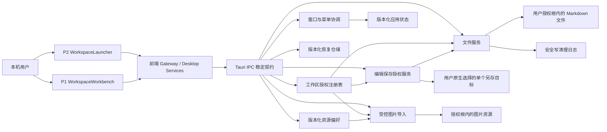

# Plainroot 桌面底座架构

## 1. 文档定位

本文描述 Plainroot 当前已经落地的桌面底座模块、数据流、权限边界和运行约束。产品范围与最终验收以 `../requirement.md` 为准，第一阶段任务状态与验证证据以 `../stage-1-desktop-foundation/plan.md` 为准；代码、清单、配置和自动化测试是实现事实源。

当前架构覆盖 P2 工作区启动页、P1 只读工作台、本地文件与窗口底座，以及尚未接入 P1 页面流程的单文档会话、Milkdown 排版 adapter、恢复快照仓储、冲突覆盖、安全另存、资源偏好和受控图片导入底座。源码编辑器、多页签、大纲、全文搜索、自动保存触发、恢复/冲突/资源弹层、完整图片输入消费者、主题工作室和分页阅读仍未落地。

## 2. 总体结构

前端只表达页面状态和用户意图，不直接以绝对路径执行磁盘写入。Rust 命令层接收 `workspaceId` 与工作区相对路径，在每次 I/O 前重新校验授权根、规范化路径、符号链接和文件类型，再调用具体文件或窗口服务。

## 3. 模块职责

| 模块 | 主要路径 | 当前职责 | 明确边界 |
| --- | --- | --- | --- |
| 根应用与页面路由 | `src/App.tsx` | 根据当前窗口工作区快照在 P2 与 P1 间切换；根启动错误交给可恢复页面状态处理 | 不维护第二套同源错误面，不伪造工作区或编辑状态 |
| P2 工作区启动页 | `src/features/launcher/` | 文件夹/Markdown 选择、授权范围确认、最近记录、失效重授权、根窗口恢复和打开方式决策 | 不删除本地目录；无真实设置页时不持久化打开偏好 |
| P1 只读工作台 | `src/features/workbench/` | 渐进文件树、只读 Markdown、文件 CRUD、删除、定位、监听、窄窗目录抽屉和工作区切换 | 不包含编辑器、页签、大纲、搜索或虚假保存状态 |
| 共享前端组件 | `src/components/` | `AppDialog`、`AsyncStatePanel` 与 `focusContainment` 统一对话框、状态优先级和焦点生命周期 | 页面业务状态保持在各自 feature；仅在第二个同职责消费者出现后抽取 |
| 排版编辑 adapter | `src/features/editor/adapters/milkdown/` | 将 Milkdown CommonMark/GFM、选择/锚点、格式与结构命令、三态剪贴板载荷、受控图片请求和性能门槛映射为统一 `EditorAdapter`；支持只读与异步销毁 | 不持有文件保存、跨模式内容或第二套权威撤销历史；超过 2 MiB 或 2000 个非空内容行时前置返回源码降级；T25 才接入 P1 |
| 桌面契约与网关 | `src/services/desktop/` | Rust↔TypeScript 类型、错误码和 IPC 调用封装 | 不把原始系统堆栈或任意绝对路径暴露为前端操作能力 |
| Rust 命令入口 | `src-tauri/src/commands/` | 对外暴露选择、授权、扫描、读取、CRUD、删除、监听和安全写命令 | 命令只接收受控标识与相对路径，磁盘成功后才返回可提交结果 |
| 文件系统服务 | `src-tauri/src/fs/` | 路径与身份、扫描、读取、变更、删除、监听、原子替换和安全写 | 默认不跟随根内符号链接；平台差异由适配层收口 |
| 窗口与菜单 | `src-tauri/src/window.rs`、`src-tauri/src/menu.rs` | 一目录一窗口、当前/新窗口决策、根会话协调、单实例转交和原生菜单 | 当前不承担页签保存门禁；只有真实消费者的菜单项启用 |
| 版本化状态 | `src-tauri/src/state.rs` | 最近工作区与根窗口会话的原子持久化、损坏备份和未知版本保护 | 不保存 Markdown 正文、打开偏好、账号或远端状态 |
| 版本化恢复 | `src-tauri/src/editor/recovery.rs`、`commands/editor.rs`、`src/services/desktop/recovery.ts` | app data 内最新单文档快照、活动脏会话保护、锁外大正文 I/O、并发读取租约、期限/条目/容量清理、损坏隔离和 IPC/TS 契约 | 不替代工作区 `.md`；当前没有自动触发或恢复 UI；正文读取与删除必须匹配已授权 workspace，读取再匹配 snapshot id 与相对路径 |
| 冲突覆盖与安全另存 | `src-tauri/src/editor/save_copy.rs`、`commands/editor.rs`、`src/services/desktop/editorSave.ts`、`src/features/editor/editorGateway.ts` | 生成冲突磁盘证据；签发绑定 workspace/path/revision/content hash 的一次性覆盖令牌；由 Rust 原生保存对话框签发单目标另存令牌；重校验父目录/目标/symlink/revision 后执行 no-replace 或原子替换；统一 UTF-8 BOM 与 LF/CRLF/CR/mixed 输出策略 | 令牌仅进程内、最多 32 项、5 分钟且确认即消费；前端确认命令不能提交绝对目标路径；工作区外目标不形成持久目录授权；当前没有 P1 可见消费者 |
| 资源偏好与图片导入 | `src-tauri/src/preferences.rs`、`src-tauri/src/editor/assets.rs`、`commands/editor.rs`、`src/services/desktop/assets.ts`、`src/features/editor/editorGateway.ts` | 按工作区保存/读取/重置资源目录；以当前授权根重新校验目录；通过 raw IPC 或 Rust 原生选择器读取 PNG/JPEG/GIF/WebP，校验签名和 20 MiB 上限后原子写入不覆盖的唯一资源名；返回工作区相对路径 | 偏好不包含正文；SVG 拒绝；原始图片不删除；上传/导入令牌仅进程内、最多 32 项、5 分钟且单次消费；只有插入成功后 confirm 保留，取消仅删除身份/hash 未变化的本次副本；当前没有 P1 图片输入消费者 |

## 4. 核心运行不变量

### 4.1 授权与路径

- 用户必须先通过系统选择器选择文件夹或 Markdown 文件；选择单文件时，展示并确认其父目录工作区范围。
- `WorkspaceRegistry` 以规范化根目录建立授权身份；同一规范化目录只允许一个可写窗口映射。
- 所有文件命令都基于工作区相对路径执行根内校验，拒绝绝对路径、`..`、越界符号链接和不支持的文件类型。
- 正式 capability 只包含 `core:default`，前端没有 Dialog、Store 或通用文件系统权限；系统选择器由 Rust 侧驱动。

### 4.2 磁盘先于界面

- 新建、重命名、移动、删除和安全写入先完成磁盘操作，前端收到成功结果后再提交文件树或页面状态。
- 失败返回稳定 `DesktopError`，携带可重试性和内容安全信息；页面不得将失败显示为成功。
- 安全写在同目录创建随机临时文件，写入并同步后执行平台原子替换；替换前再次核验文件修订，避免静默覆盖外部修改。
- 冲突覆盖继续复用安全写双重 revision 校验；覆盖令牌还绑定当前编辑内容 hash，确认后内容变化或令牌重放都必须重新取得证据。
- 另存目标只能来自 Rust 原生保存对话框。本次目标被规范化为父目录身份、文件名和可选目标 revision 后写入一次性令牌；确认时再次核验，目标已存在必须提交显式覆盖意图，新目标使用 no-replace。
- 工作区源副本保留可验证的 UTF-8 BOM 与单一换行风格；mixed 或不支持编码必须明确选择 UTF-8 输出格式，全新无基线内容默认 UTF-8 + LF。
- 图片资源目录只能是授权根内的规范化相对目录，不能经过符号链接。资源先以私有随机临时文件写入并同步，再通过平台 no-replace 提交唯一名称；编辑器只能消费返回的相对路径，不能把任意绝对目标交给导入命令。
- 排版 adapter 只消费统一会话投影并发出带 generation/editVersion 的变更；Cmd/Ctrl+Z 与重做桥接会话 history，不启用 Milkdown 第二套权威历史。富文本粘贴只保留可表达结构，主动内容、危险 URL 和外部图片不能绕过受控资源导入。
- 排版可交互性同时受 UTF-8 字节数和非空内容行数约束；当前证据门槛为 `≤2 MiB 且 ≤2000 个非空内容行`，超出时在创建 Milkdown 前转源码模式。行数采用不拆分全文的流式计数，能覆盖没有空行分隔的紧凑列表和表格；该门槛是可复测的保守技术安全值，不是 Markdown 文件总上限。
- 资源服务返回的 `assetPath` 是工作区相对路径；编辑器插入 Markdown 前必须根据当前文档所在目录转换为文档相对链接。根目录与多层子目录文档不能共用未经转换的链接文本。
- 图片落盘与 Markdown 插入是显式两阶段：落盘返回 import token，插入成功后确认保留，插入失败/取消时仅凭原生文件身份、长度与 SHA-256 清理本次未变化副本。强制进程终止可能在两阶段之间留下孤立资源，缺少持久证据时不得猜测删除。
- 文件监听把应用自身变化与外部变化分开归并，最终以磁盘重扫保持一致，不把平台事件序列当作跨平台契约。

### 4.3 窗口与状态事务

- 当前窗口替换先完成窗口/工作区协调和持久状态提交，再更新内存授权映射；失败时保留原窗口状态。
- 新窗口创建若后续持久化失败，会关闭未提交窗口并释放目标授权，不留下第二个可写映射。
- 最近记录或单个根会话恢复失败不得阻断其他记录和窗口；移除最近记录只修改辅助状态，不删除本地文件。

## 5. 数据、配置与权限

| 数据或配置 | 路径/来源 | 内容与上限 | 回退与安全边界 |
| --- | --- | --- | --- |
| Markdown 内容 | 用户授权工作区 | 真实 `.md` 文件，单次内联读取/写入上限 64 MiB | 不随应用版本回滚；失败保持原文件或明确报告内容安全性 |
| 应用状态 | 操作系统 `appDataDir()/plainroot-state-v1.json` | schema v1；最近工作区最多 100 条；文件上限 8 MiB | 损坏文件备份后回到安全默认；未知版本不覆盖；退出应用后可备份并删除 |
| 安全写清理日志 | `appDataDir()/plainroot-safe-write-cleanup-v1.json` | 最多 32 个待清理临时路径；日志上限 64 KiB | 只重试历史授权根内且重新校验通过的 Plainroot 临时文件；不可再授权条目不占全局预算 |
| 恢复快照 | `appDataDir()/plainroot-recovery-v1/` | schema v1；每文档最新一份；默认 7 天、32 项、正文总量 128 MiB；snapshot/manifest 为私有原子文件；大正文读写不持有全局 manifest 锁 | 活动脏会话最后快照不被自动清理；读取租约防止并发删除提前移走正文；容量/写入失败降级为仅内存安全且后续成功写可恢复；未知版本不覆盖；不读取或删除未授权工作区快照 |
| 资源目录偏好 | `appDataDir()/plainroot-preferences-v1.json` | schema v1；按 `workspaceId` 保存 `assetDirectory`；默认 `assets/`；文件上限 1 MiB、最多 1000 个工作区 | 私有临时文件 + 原子替换；写失败保留磁盘和内存旧值；损坏文件备份后回默认；未知版本不覆盖；删除该文件只恢复默认，不删除已导入资源 |
| 图片资源 | 用户授权工作区的当前 `assetDirectory` | PNG/JPEG/GIF/WebP；单项上限 20 MiB；唯一可读文件名；Markdown 只引用工作区相对路径 | 文件签名而非扩展名为准；SVG/伪造 MIME/超限拒绝；原始选择文件不删除；确认前取消只清理本次且未被外部修改的副本 |
| 正式 Tauri 配置 | `src-tauri/tauri.conf.json`、`src-tauri/capabilities/default.json` | 开发 identifier、窗口尺寸、CSP 与最小 `core:default` capability | 不授予全 HOME 或前端通用文件权限；正式品牌身份与签名发布前另行确认 |
| E2E 配置 | `src-tauri/tauri.e2e.conf.json`、Cargo `e2e` feature | 独立 identifier、临时状态目录和 WebDriver 能力 | 编译期 feature 默认关闭，不进入正式依赖图、前端产物或生产二进制 |

当前没有 SQL、数据库 schema、seed、业务账号、密钥或产品运行所需环境变量。`PLAINROOT_E2E_DATA_DIR` 只存在于编译期隔离的 E2E 测试构建，用于每次测试的临时状态目录，不是生产配置。

## 6. 菜单与原生能力

- 已启用并有真实消费者：打开文件夹、打开 Markdown 文件、新建窗口、关闭窗口。
- 编辑、显示和后续文档命令保持禁用；禁用项不发出成功反馈。
- Finder/Explorer 定位、系统回收站与永久删除都通过 Rust 受控命令执行；回收站失败不会自动降级为永久删除。
- 单实例插件仅在 macOS/Windows 注册，第二实例只转交有界启动参数并聚焦现有进程，不直接据参数授权路径。

## 7. 测试与跨平台边界

- `pnpm test` 覆盖许可证策略、路径代数、文件树 reducer、fixture 和 React 页面/组件状态；Rust 测试覆盖授权、路径、状态/恢复/偏好仓储、文件操作、安全写、监听、窗口事务和资源导入。T22 的资源测试覆盖签名、上限、重名、symlink、原子失败、错误工作区、令牌生命周期、取消换靶和 raw IPC body 类型。
- `pnpm test:e2e` 使用独立 identifier 与临时状态目录，覆盖 P2/P1 的真实 Tauri IPC、关键窗口宽度和 fixture 工作区扫描读取。
- GitHub Actions 在 macOS/Windows 运行许可证、类型、前端/Rust、桌面 E2E 和未签名生产构建。远端已确认的基线提交为 `9a1690a`；其后的本地审查修正不能外推为新的远端 Windows 证据。
- macOS 已有系统选择器、Finder、废纸篓、多窗口、监听和单实例人工证据。Windows 原生选择器、回收站、Explorer、菜单和辅助技术仍需人工实机验收；网络卷、休眠、文件系统卸载和超大目录长时行为也没有产品级证据。

## 8. 演进约束

- 后续编辑器、页签、主题、阅读和搜索阶段必须复用本模块的授权根、稳定错误、磁盘先行、窗口身份和状态隔离契约，不能从前端绕过 Rust 文件边界。
- 引入新的持久化格式、数据库、 capability、菜单或生产环境变量时，必须同步记录定义位置、读取/消费时机、影响范围、损坏回退和数据迁移。
- 若未来采用 App Store 沙箱、安全作用域书签或正式签名分发，授权持久化和发布配置需要独立架构评审，不能把当前直接分发假设静默沿用。
