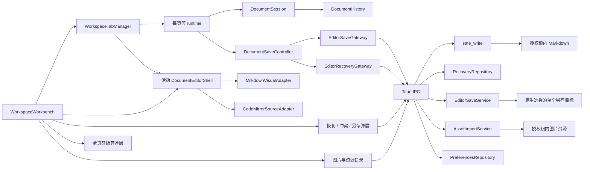

# Plainroot Markdown 文档编辑架构

## 1. 文档定位

本文描述 Plainroot 当前已经落地的 Markdown 编辑模块，包括统一内容模型、排版/源码投影、保存与恢复、外部冲突、另存副本、图片资源、窗口结算和菜单状态，以及第三阶段已接入 P1 的每页签独立文档 runtime 与可见页签交互。产品范围与验收口径以 `../requirement.md` 为准，第二阶段任务状态与证据以 `../stage-2-markdown-editing/plan.md` 和 `../stage-2-markdown-editing/t32-stage-acceptance.md` 为准，第三阶段当前进度见 `../stage-3-tab-window-lifecycle/plan.md`；代码、清单、配置和自动化测试是实现事实源。

`desktop-foundation.md` 负责工作区授权、文件系统、窗口和应用状态等跨模块底座概览；本文是 Markdown 文档编辑子系统的专项事实源。T35～T41 已建立页签状态、元数据仓储、P1 多 session runtime、可见页签容器、最近关闭、当前会话元数据写入、两阶段安全结算、磁盘成功后的多 runtime 路径重映射/批量关闭，以及窗口替换、关闭和退出对同一完整批次的消费；窗口会话仓储尚未在启动时恢复 runtime。大纲、工作区搜索、分页阅读、主题工作室和完整布局持久化不属于本文所述的已完成能力。

## 2. 模块边界

- `WorkspaceWorkbench` 负责文件树、watch、页面弹层、窗口结算意图和活动编辑器投影的组合，不持有第二份 Markdown。
- `WorkspaceTabManager` 按 Rust 返回的 opaque 路径身份唯一打开/聚焦文档；每个已加载页签 runtime 独立持有一个 `DocumentSession` 和 `DocumentSaveController`，但只有活动 runtime 被投影为真实 editor。
- `tabSettlement` 与 `TabSettlementDialog` 固定一次操作的页签 incarnation 集合，复用各 runtime 的保存控制器、冲突和另存能力，只有全部目标重新校验安全后才允许一次性提交关闭或文件操作。
- `DocumentSession` 是对应页签的唯一前端内容、历史、选择、锚点、保存和内容安全状态。
- Milkdown 与 CodeMirror 只是 `DocumentSession` 的可替换投影，不直接写磁盘，也不各自维护跨模式权威历史。
- `DocumentSaveController` 是自动保存、手动保存、恢复快照和关闭结算的唯一前端调度器。
- Rust 命令与服务负责授权、路径、revision、原子写、恢复仓储、一次性令牌和图片签名等安全边界；前端只提交用户意图和受控标识。

## 3. 统一文档模型

### 3.1 会话状态

`src/features/editor/documentSession.ts` 定义以下稳定状态：

- 生命周期：`empty`、`loading`、`ready`、`unavailable`。
- 保存：`clean`、`dirty`、`saving`、`saved`、`save_failed`、`readonly`、`conflict`。
- 内容安全：磁盘、仅内存、恢复快照、明确风险。
- 恢复：无、可用、持久化中、失败。
- 投影：`visual` 或 `source`，并独立保存选择与语义/源码锚点。

`ReadyDocumentSession` 同时保存 `generation`、`editVersion`、Markdown、磁盘 `FileRevision`、已持久内容摘要、UTF-8 编码/换行基线、统一历史、兼容性证据和冲突证据。异步结果必须同时匹配文档身份、`generation` 和适用的 `editVersion`；陈旧读取、解析、保存、恢复或图片结果不能改写新会话。

### 3.2 单一内容源与历史

- 所有编辑事务先进入 `DocumentSession`，再由 React 投影回当前 adapter。
- 模式切换先同步当前 adapter 的 Markdown、选择与锚点，再销毁旧投影并创建新投影。
- Milkdown 与 CodeMirror 的撤销/重做均桥接 `documentHistory.ts`；adapter 内部历史不作为权威来源。
- 历史以可逆文本 patch 保存，默认预算 8 MiB、最多 500 项；预算只约束历史内存，不表示大文档编辑是常数时间。
- 当前 patch 生成、内容摘要和安全写仍包含 O(全文长度)工作。64 MiB 是文件服务边界，不是排版编辑性能承诺。

### 3.3 Markdown 兼容性

- Remark + GFM 负责生产兼容性证据，未知或不安全往返语法转为源码模式，不由排版序列化静默吞掉。
- mixed 换行文档默认进入源码模式；CodeMirror 的 LF 内部视图通过 raw projection 映射回原始 CRLF、CR 或 mixed 文本。
- 排版编辑在创建 Milkdown 前执行双门槛：Markdown 不超过 2 MiB，且非空内容行不超过 2000。超出门槛安全降级到源码，不改变文件服务 64 MiB 上限。
- 排版与源码 adapter 都必须单调推进本地 `editVersion`，拒绝同一 generation 的较低版本投影覆盖新输入。

### 3.4 页签集合模型

`src/features/tabs/` 已建立第三阶段的页签状态与 runtime 边界：

- `WorkspaceTabDescriptor` 只保存窗口内 `tabId`、不可复用的 incarnation、Rust 规范化工作区相对路径及不透明平台路径身份、派生显示信息、加载状态、视图恢复元数据和最后活动时间，不保存 Markdown、history 或保存控制器。前端不得自行 lower-case 或把反斜杠转换成索引身份。
- `WorkspaceTabManager` 持有独立 runtime map；每个 runtime 包含 `DocumentSession` 与 `DocumentSaveController`，且必须带与 descriptor 相同的 incarnation。活动 selector、状态投影、读取完成和 session 更新都会拒绝旧 incarnation/generation，editor adapter 不进入页签 DTO 或恢复描述。
- reducer 使用有序 ID、平台路径身份索引、活动项、最近关闭、单调 incarnation 和 revision 表达唯一打开、聚焦、排序、关闭/恢复、陈旧 load generation/incarnation 拒绝和待持久化状态，并双向校验 map key、descriptor、顺序、路径索引、活动项、最近关闭路径及其派生显示字段。
- 页签主状态与 `AsyncStatePanel` 共同消费 `src/components/asyncState.ts`，遵循 DESIGN 的统一优先级与 assertive/polite 契约；尚未读取的惰性页签投影为 unloaded，不能误报为 empty。
- P1 文件树入口通过 `tabSessionGateway` 消费 Rust 规范化路径和 opaque identity；同一身份只聚焦既有 runtime。切换前由活动 `DocumentEditorShell` 提交 Markdown、选择与锚点，切换后只挂载目标 runtime 对应的 Milkdown 或 CodeMirror adapter。
- 非活动 dirty runtime 保留 history、模式和视图状态，并由自身 controller 继续自动保存/恢复快照。T40 的结算批次以 `tabId + incarnation` 固定目标，放弃/另存证据和最终破坏性关闭目标再绑定 `generation + editVersion`；保存中或异步删除期间继续编辑会使旧证据失效并回到阻塞态。取消不移除任何页签，已经真实写盘的保存或删除不做虚假回滚。
- T38 的 `WorkspaceTabBar` 直接消费 manager 快照，提供真实 tablist、同名父路径、公共主状态、单页签关闭、当前窗口拖动/键盘排序和全部页签溢出；`TabOverflowMenu` 与 `TabContextMenu` 共同消费 `TabMenu` 的方向键、Esc 和焦点返回。T40 已启用关闭其他、关闭右侧和关闭全部，全部动作委托同一结算批次，不复制保存判断。
- T39 让溢出菜单列出最近关闭项；重开必须重新经过 Rust 路径身份解析，失败项保留真实错误并可只移除元数据。`tabSessionProjection` 与 `WorkspaceTabSessionPersistence` 将当前顺序、活动项、视图和最近项以防抖/CAS 写入既有仓储，且不覆盖 T42 尚未恢复的既有非空会话。
- `tabPathImpact` 在 rename/move/delete 调用磁盘前纯计算受影响页签、目标路径和所有已加载文档的内联图片链接改写预案。命中打开页签时先走统一结算；Rust 磁盘操作失败时保留原路径和全部页签，成功后 `WorkspaceTabManager` 才以一次 collection revision 提交路径/identity/runtime 或页签移除。目录移动后再按新路径重新计算全部受影响已加载页签的内联图片链接；manager 生成的链接改写直接结算已提交 runtime，不重新采集 React 尚未更新的活动 adapter 旧投影。若其中某次安全写失败，目录移动事实保持、对应页签保持 dirty 并给出真实提示，不伪装为整批磁盘回滚。
- 真实 Tauri/WebKit 门禁使用三个文档、36 次可见页签切换，逐次断言页面只有一个 `.ProseMirror` 或 `.cm-editor`，并以测试 feature 的进程 RSS 采样执行增量 ≤128 MiB 的可失败门禁；另验证溢出菜单 Esc 焦点返回及 1100/820/740 px 不产生根级横向溢出。当前 WebKit 未暴露 JS heap，因此只以单 adapter 与 RSS 作为已取得证据；JS heap 由 T45 在可观测平台补证，不能宣称已通过或取得双平台内存证据。
- 窗口页签元数据仓储已经落地，T39 已接入当前会话的最近关闭和顺序持久化；T42 尚未把既有会话接入启动恢复。仓储发现既有非空会话时继续冻结当前元数据写入，直至 T42 真实消费并切回可写状态。

## 4. 保存、恢复和冲突

### 4.1 自动与手动保存

`DocumentSaveController` 根据 UTF-8 字节数使用 800 ms、2 秒或 5 秒自动保存防抖；恢复快照通常为 2 秒，大正文为 10 秒。保存与快照分别单飞，保存中的后续编辑必须在当前写入结束后追赶到最新 `editVersion`。

保存统一调用 Rust `safe_write`：

1. 校验当前工作区授权、相对路径、文件类型和基线 revision。
2. 在同目录创建私有随机临时文件，写入并同步。
3. 替换前再次读取并比较 revision，防止 TOCTOU 覆盖。
4. 使用平台原子替换提交，并返回新的 `FileRevision`。
5. 前端只有收到成功 revision 后才把 session 标为安全。

UTF-8 BOM 与单一 LF/CRLF/CR 优先沿用原文件；mixed 或不支持编码的另存必须由用户明确选择 UTF-8 输出格式。

### 4.2 恢复快照

恢复数据位于 `appDataDir()/plainroot-recovery-v1/`：

- manifest：`manifest-v1.json`，schema v1，上限 1 MiB。
- 正文：`snapshots/snapshot-v1-*.md`，opaque 文件名。
- 策略：每个工作区/文档保留最新一份，默认 7 天、最多 32 项、正文总量 128 MiB。
- 活动脏会话受保护；大正文文件 I/O 不持有全局 manifest 锁，并发读取使用租约避免删除竞态。
- 损坏项隔离；未知 schema 不覆盖；写入不可用时明确降级为仅内存安全，后续成功写可恢复持久化状态。

恢复只把快照载入 dirty session，不直接覆盖 `.md`。读取和删除都必须同时匹配已授权 `workspaceId`、快照 id 与相对路径。

### 4.3 外部修改与删除

- watch 事件只触发重新核对；磁盘 revision/hash 是最终权威。
- 外部修改进入 `conflict`，展示路径、磁盘修订、当前内容安全性和重载/覆盖/另存/保持选项。
- 覆盖必须先取得绑定 workspace、相对路径、最新 revision 和当前内容 hash 的一次性令牌，再显式二次确认。
- 外部删除不清空内存 Markdown。只有恢复快照或同一 generation/editVersion 的另存结果足以保护内容时，关闭才可继续。

### 4.4 另存副本

工作区外目标只来自 Rust 原生保存对话框。前端确认命令不提交绝对路径，只提交一次性令牌、内容和明确的覆盖决定。已有目标在确认前后均复核 revision；新目标使用 no-replace，已有目标使用同目录临时文件与平台原子替换。单目标授权不转化为目录或工作区权限。

## 5. 图片和资源目录

### 5.1 偏好

资源目录偏好位于 `appDataDir()/plainroot-preferences-v1.json`：

- schema v1，文件上限 1 MiB，最多 1000 个工作区。
- 每个 `workspaceId` 只保存根内 `assetDirectory`，默认 `assets/`。
- 配置写入使用私有临时文件与原子替换；损坏文件备份后回默认，未知 schema 不覆盖。
- 重置只删除偏好记录，不删除已经导入的资源文件。

### 5.2 导入与引用

- 支持 PNG、JPEG、GIF、WebP，单项上限 20 MiB；以 Rust 二进制签名为准，SVG 明确拒绝。
- 系统选择、粘贴和拖放都进入受控导入服务。资源先原子写入不覆盖的唯一文件名，再签发最多 32 项、5 分钟、单次消费的 import token。
- Markdown 插入成功后 confirm 保留资源；失败或取消只在文件身份、长度和 SHA-256 未变化时清理本次副本。
- Rust 返回工作区相对 `assetPath`；写入 Markdown 前必须按当前文档目录换算为文档相对链接。
- 图片预览由 Rust 重新校验授权根、普通文件、大小和签名后返回原始字节；WebView 只创建可撤销 Blob URL，不获得通用文件协议权限。
- 当前打开文档或其包含目录移动时，先结算全部受影响页签并提交磁盘移动，再按 Markdown AST 位置重写全部受影响已加载 `DocumentSession` 中的内联图片 URL；引用式图片定义当前不在自动改写范围。
- 移动已配置资源目录或递归包含 PNG/JPEG/GIF/WebP 的目录前，Rust 以当前授权根和资源偏好为依据执行最多 10,000 个目录项的有界检查。命中配置目录、图片扩展名或检查无法完整完成时，P1 必须提示“未打开 Markdown 文档中的相对图片链接可能失效”；取消不调用移动命令，继续按钮明确“链接可能失效”。
- 目录风险检查只表达潜在影响，不解析 Markdown、不声称已经找到具体引用，也不批量改写其他文档。真正的跨文档引用索引和批量链接维护仍未实现。

## 6. 页面、菜单与窗口结算

- P1 的 `DocumentEditorShell`、工具栏、持续状态栏和恢复类弹层全部消费当前活动 runtime 的 `DocumentSession`。
- 工具栏和原生菜单经同一命令总线执行保存、另存、撤销/重做、当前文档查找、排版/源码切换；菜单启用状态来自聚焦窗口的 `hasDocument/readOnly/busy/canUndo/canRedo/mode`。
- P2 没有文档时重置编辑菜单；工作区搜索、可见页签命令、阅读、主题等没有真实消费者的入口继续禁用或隐藏。
- 单页签、关闭其他、关闭右侧、关闭全部和命中打开页签的 rename/move/delete 统一创建不可变结算批次。前端逐项复用 `DocumentSaveController.settle()`、冲突处理和另存副本；dirty/save_failed/readonly/conflict 等状态未解决前最终动作禁用，全部安全后才一次性提交页签集合变化。
- 系统关闭、菜单关闭、当前窗口根替换和应用退出的一次性 Rust intent 已接入同一全页签结算。取消显式拒绝 intent；全部安全后先持久化内容无关页签会话，再允许 Rust 提交窗口事务；最终提交失败保留原页签和可重试批次。
- P1/P2 共用当前窗口/新窗口/取消决策与 `ask/current_window/new_window` 打开偏好；偏好只改变打开位置，不能跳过授权、同目录聚焦或全页签结算。T42 尚未恢复的既有非空会话仍冻结元数据覆盖。

## 7. 权限和配置边界

| 对象 | 权威位置 | 安全边界 |
| --- | --- | --- |
| Markdown | 用户授权工作区 | Rust 根内相对路径校验；单次读取/写入上限 64 MiB |
| 恢复正文 | 应用数据目录 | 独立版本化仓储；不替代源文件、不上传 |
| 资源目录偏好 | 应用数据目录 | 只保存根内相对目录；读取和写入时重新校验工作区 |
| 图片资源 | 授权根内资源目录 | 签名白名单、20 MiB、no-replace、一次性导入令牌 |
| 另存目标 | 用户本次原生选择的单个文件 | 一次性目标令牌；不授予父目录长期权限 |
| 前端 capability | `src-tauri/capabilities/default.json` | 仅 `core:default`；无通用 filesystem/dialog capability |

当前没有 SQL、数据库 schema、seed、业务账号、密钥或生产环境变量。`PLAINROOT_E2E_DATA_DIR` 只存在于编译期隔离的 E2E 构建，不是产品配置。

## 8. 验证与可观测性

- `pnpm test` 统一执行 Node 独立回归、全部 Vitest 和 Rust 非桌面服务门禁。
- `pnpm test:editor` 覆盖 session、history、两种 adapter、保存控制器、恢复/冲突/资源组件和页面集成。
- `pnpm test:tabs` 覆盖页签状态机、状态投影、恢复边界、manager 独立 session/controller、慢读取隔离和活动 runtime 唯一性；`pnpm test:tabs:performance` 仍只输出 100 个轻量描述的打开、索引和切换基线。
- `pnpm test:roundtrip` 使用生产 adapter 验证 CommonMark/GFM、图片、受支持 HTML 与 source-only 语料。
- Rust 契约测试登记所有 TypeScript 导出 interface 和字符串枚举/tag，防止 Rust↔TypeScript 字段漂移。
- `pnpm test:e2e` 使用独立 identifier、临时状态目录和每套件复制的临时工作区，当前本地 11 条真桌面用例除既有 P1/P2、两种模式、图片、保存重开、外部修改、恢复和目录图片移动风险外，还覆盖三文档可见页签切换、溢出菜单焦点返回、1100/820/740 px 页签布局、单 adapter/RSS 门禁，以及关闭右侧和打开页签的真实改名、移动、图片链接写回、删除。
- 远端 GitHub Actions run `30082725332` 已在提交 `914ad8413b30569ab1c704dc1a55f15d3ed78c59` 上完成 macOS/Windows 双绿；该矩阵仍只覆盖第二阶段 9/9 桌面 E2E。T41 当前本地为 254 项 Vitest、201 个 Rust 通过且 1 项手动探针忽略、11/11 macOS 桌面 E2E，尚未推送，不能沿用旧运行宣称第三阶段双平台通过；T41 新增窗口 intent/偏好的完整桌面用例仍由 T45 补齐。

## 9. 已知边界

- 系统 IME 候选窗、系统剪贴板、Finder/Explorer 原生拖入、原生保存/图片选择器、系统关闭/退出和 Windows 原生辅助技术仍缺完整人工证据；WebView 自动化不替代这些证据。
- 大文档 patch/hash/save 仍是 O(全文长度)，源码 chunk 仍超过 500 kB 告警；现有阈值与分级防抖是安全运行值，不是最终性能定稿。
- 图片节点按项异步读取，当前没有全局并发或 Blob 总量预算；多图文档峰值内存未形成双平台证据。
- 目录图片移动风险检查按配置目录、受支持扩展名和有界遍历判断，不能证明图片确被某个 Markdown 引用；它以可能多提示一次换取不静默断链。其他文档不会自动批量改写，跨文档引用索引仍属于后续能力。
- 当前文档移动后的自动改写只覆盖内联图片语法；引用式图片定义不在改写范围。
- JPEG/WebP 签名校验采用保守完整信封，少数带尾随数据的合法文件可能被拒绝；前后端 WebP 预检严格度仍应继续保持一致。
- 强制终止发生在“资源已落盘、Markdown 尚未确认插入”之间时可能留下孤立资源；缺少持久证据时不猜测删除用户文件。
- T41 已由 P1 消费页签 runtime、可见页签、最近关闭、当前会话元数据写入、完整页签结算、磁盘成功后的批量重映射/关闭和窗口替换/关闭/退出 intent；已有会话启动恢复、原生页签命令和双平台证据仍未完成，当前不能把这些子集写成完整 R13/R14 或第三阶段完成。大纲、工作区搜索、分页阅读、主题预设和完整响应式布局仍属于后续阶段。
