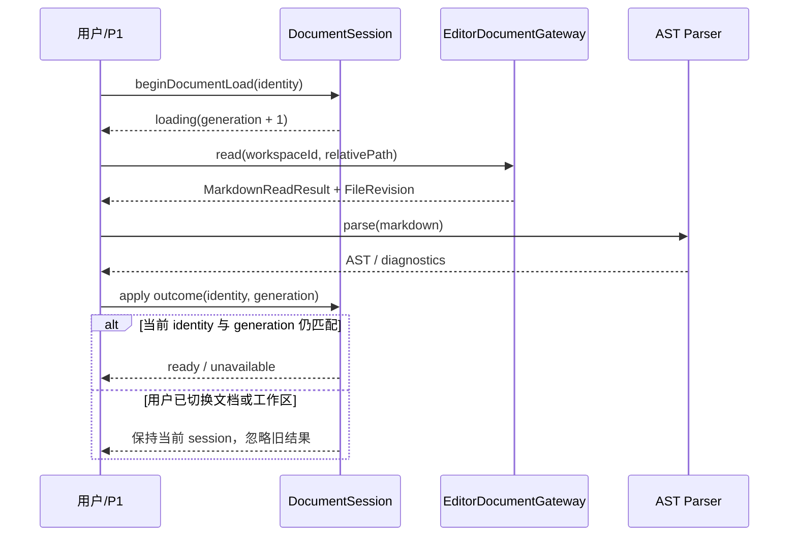

# T19 统一文档会话开发留痕

## 1. 功能的详细需求

T19 对应 R2、R3、R5、R10、R11 的文档领域模型子集，目标是在正式编辑器接入前建立当前窗口单文档的唯一内容源，并满足以下约束：

- 文档身份、Markdown、磁盘 revision、编码/换行、编辑版本、模式、选择/锚点、保存、安全、恢复和冲突状态必须由可枚举类型表达；
- Milkdown 与 CodeMirror 后续只能作为同一 `DocumentSession` 的投影，不能各自维护跨模式内容或撤销事实源；
- 读取和编辑异步结果必须绑定 workspace、relative path、generation 与 editVersion，陈旧结果不能覆盖当前文档；
- 撤销历史使用可逆 patch、事务分组与内存上限，不得按每次按键保存完整 64 MiB 正文；
- 编码和换行只从 Rust `FileRevision` 建立并在成功保存后刷新；mixed 换行不能在未确认时静默规范化；
- 不支持语法的生产判定只消费 Markdown AST/解析诊断，不把 T18 的行级启发式升级为事实源；
- 本任务不创建页签集合、恢复仓储、自动保存、冲突覆盖、图片资源或正式编辑控件。

事实源为 `requirement.md` 的 R2/R3/R5/R10/R11、阶段 2 `plan.md` 4.2～4.4 与 6.2。

## 2. 功能开发的实际结果

T19 已完成，可以进入 T20，但不代表产品编辑器或 R3/R5/R10 已验收完成。

- `documentSession.ts` 建立 `empty/loading/ready/unavailable` 会话 union，以及 `clean/dirty/saving/saved/save_failed/readonly/conflict` 保存 union；`contentSafety`、恢复和冲突证据也为显式类型。
- `sourceFormat` 只由 `FileRevision.encoding/lineEnding` 投影；读取与成功保存分别建立和刷新该基线。UTF-8、UTF-8 BOM、none/LF/CRLF/CR/mixed 均有测试；mixed 暂时强制 source-only。
- generation 同时校验 workspace 与 relative path，edit transaction 再校验 editVersion。P1 原来的页面私有 read state 已迁移到统一 session，同一工作区连续选择两份文档时，慢返回的旧读取不会覆盖后选文档。
- `DocumentHistory` 记录最小可逆文本 patch；同一 transaction group 保存为一个撤销项内的多个步骤，撤销/重做恢复跨模式内容与选择。初始上限为 8 MiB patch 数据或 500 项，超限淘汰最旧项并设置 `truncated`。
- 64 MiB 文档末尾追加一个字符的专项测试中，历史只保存 1 B 插入 patch；没有把 64 MiB 原文复制进历史项。若单个 patch 自身超过预算，当前编辑仍成立，但该步不进入历史。该实现的前缀扫描、前后 hash、slice 和撤销校验仍是 O(全文长度)，本机两次报告为记录约 486～487 ms、撤销约 255～258 ms；这只是一台机器的局部证据，不是产品阈值，也不代表大文档编辑性能通过。
- `markdownCompatibility.ts` 只遍历解析器提供的 AST 和 unmapped syntax 诊断；CommonMark/GFM/raw HTML 节点可进入 visual，frontmatter、directive、MDX、未知节点、解析失败进入 source-only。真实 Milkdown parser 由 T23 adapter 提供，T19 没有伪造解析结果接入 P1。
- session 提供绑定 generation/editVersion 的 compatibility 重评估：源码删除未知语法或把 mixed 换行规范化后，新的解析证据可以解除 source-only；陈旧解析结果不能覆盖当前内容。若 visual 内容被新证据判为不安全，会同步回到 source 投影并转换选择锚点。
- `beginDocumentSave` 在已有 `saving` 时返回 `save_in_flight`，不会用第二个 requestId 覆盖首个磁盘请求；T26 的控制器仍必须做外层单飞和 pending edit 追赶。
- `EditorAdapter` 明确定义 load/apply/focus/selection/change/command/destroy 契约；`WorkspaceWorkbenchGateway` 继承统一 `EditorDocumentGateway` 读取接口，没有复制第二套 read 定义。
- P1 仍显示“只读 Markdown”，没有提前开放编辑、保存或模式切换；本任务没有数据库、SQL、seed、Tauri capability、菜单、产品配置、环境变量或用户文件写入变化。

## 3. 功能开发的具体实施方案

### 3.1 读取与陈旧结果



`requestDocumentLoad` 只产生带原请求身份的 outcome，`applyDocumentLoadOutcome` 才对当前 state 执行提交。解析器抛错时读取内容不丢弃，安全降级 source-only；磁盘读取失败则保留真实 `DesktopError`。

### 3.2 编辑、历史与保存竞态

- 每个 adapter change 携带 generation、expectedEditVersion、Markdown、模式、选择、锚点和 transaction group。
- patch 由共同前后缀计算，保存 `start/removed/inserted`；应用时还会核对被替换片段，前后 FNV hash 仅用于内存历史排序保护，磁盘冲突仍以 Rust SHA-256 revision 为权威。
- 同组输入追加 patch step，不保存中间全文；撤销逆序应用 inverse steps，重做正序应用 forward steps。
- 保存开始记录 requestId 和当时 editVersion。保存期间继续输入或撤销时，session 保留 requestId 并标记 `changedAfterStart`；旧写入成功只刷新对应磁盘 revision/sourceFormat，当前较新内容仍为 dirty。
- 保存失败不修改 Markdown，并把 contentSafety 保持为 memory 或与当前内容匹配的恢复证据；T20 才实现真实恢复仓储。

### 3.3 复用判断

- 复用既有 `FileRevision`、`TextEncoding`、`LineEnding`、`DesktopError` 与工作台读取服务，没有新增平行 DTO。
- `WorkspaceWorkbenchGateway` 通过继承 `EditorDocumentGateway` 消费统一读取契约；P1 直接消费 `DocumentSessionState`，没有继续保留页面私有文档状态机。
- 历史、AST 兼容性和 editor adapter 是不同变化原因，分别保持纯模块，不合并为大型 editor service。
- T18 `poc/markdownCompatibility.ts` 保留为 PoC 证据；生产 `markdownCompatibility.ts` 是 AST/诊断消费者，两者没有互相导入，避免行级近似进入产品事实源。
- 本任务无第二个页面、弹层或样式实现，因此不新增 UI 公共组件，不修改 `DESIGN.md` 组件登记。

## 4. 上线部署操作

T19 是纯 TypeScript 领域模型与既有 P1 状态迁移，不需要 SQL、seed、数据迁移、权限、菜单、Tauri capability、产品环境变量或配置初始化。新增稳定验证命令：

```bash
nvm use
pnpm test:document-session
pnpm test:document-session:performance
pnpm typecheck
pnpm test
pnpm build
```

回滚只需回滚 T19 代码、测试和文档提交；没有持久格式或用户文件需要回滚。`package.json` 只增加测试脚本，锁文件未变化。

## 5. 验证情况

### 5.1 已执行并通过

- `pnpm test:document-session`：3 个文件、28/28；
- `pnpm test:document-session:performance`：64 MiB / 1 B patch 正确性通过；本机两次 record 486.05～487.45 ms、undo 254.79～257.96 ms，机器相关，不作为固定阈值；
- `pnpm typecheck`；
- `pnpm test`：许可证 4/4、永久删除反馈 4/4、路径 3/3、树状态 18/18、fixture 1/1、Vitest 汇总 71/71；
- `pnpm build`：生产 JS 249.63 kB / gzip 76.91 kB；统一 session 已由 P1 消费，因此该小幅增量真实进入正式入口；
- `git diff --check`；
- 关键覆盖：空文档、UTF-8 BOM、none/LF/CRLF/CR/mixed、AST source-only 与重评估解锁、陈旧解析结果、文档/工作区/generation/editVersion 陈旧结果、patch 逆向、事务合并、跨模式撤销/选择、内容 hash 不匹配、8 MiB/500 项边界、单 patch 超限、64 MiB 小编辑、保存成功刷新格式、保存重入、保存中继续输入/撤销、保存失败内容安全、P1 同工作区快速切文档。

### 5.2 未执行或仍待验证

- 没有运行真实 Milkdown/Remark AST parser；T19 只定义并测试 parser evidence 契约，T23 负责真实 adapter 与 parser 接线。
- 没有执行真实 IME、Milkdown/CodeMirror 产品挂载、自动保存、恢复、冲突或图片资源验证；分别由 T20～T31 承接。
- 本任务未重跑 Rust 测试、Tauri 打包、桌面 E2E、macOS 人工 UI 或 Windows CI，因为没有 Rust、IPC、capability、菜单和可见 UI 行为变化；既有平台证据不得外推为 T19 远端通过。
- 64 MiB 探针已经证明当前 patch/history CPU 为明显的 O(n) 风险，但未运行 Milkdown 挂载、连续真实输入、峰值内存或保存写盘；T23/T26/T31 必须把每击延迟和安全降级作为门禁，不能只复用 1 B 内存结论。

## 6. 关联文档同步结论

- `requirement.md`：更新第二阶段为 T18～T19 已完成、T20 待开始，并明确 P1 只读链路已消费统一 session；R 编号、范围、建议项、验收标准和遗留确认项不变。
- `plan.md`：更新 T19、R2/R3/R5/R10/R11 状态、任务实际落地、测试基线和历史预算；T20 仍待开始。
- `README.md`、`AGENTS.md`：更新稳定代码边界、命令、测试数量和未验证边界。
- `DESIGN.md`、页面流程：不需要更新，因为没有页面布局、视觉 token、组件、弹层或交互规范变化；P1 只读表现保持原样。
- `CLAUDE.md`：不需要更新，因为没有新增长期 AI 协作规则。
- `architecture/desktop-foundation.md`：不需要更新，因为桌面授权、窗口、IPC、状态仓储和文件系统架构未变；编辑领域架构将在真实 editor/save/recovery 模块完成后由 T32 统一归档，当前稳定边界已由本留痕和代码表达。
- SQL、seed、权限、菜单、Tauri capability、产品配置与环境变量文档：不需要更新，因为本任务没有产生对应变化。

## 7. T19 复核整改

- P1（大文档 CPU）：认可。新增可重复性能报告并把“1 B patch”限定为内存结论；当前 O(n) 记录/撤销耗时已进入计划风险，T23/T26 明确承接每击延迟、增量方案或安全降级门禁。本轮没有虚构已完成的性能优化。
- P2（compatibility 锁死）：认可并修复。新增绑定 generation/editVersion 的重评估 API，mixed 换行规范化或未知语法移除后可以解除 source-only；陈旧解析不应用，反向降级会同步转换模式与选择锚点。
- P3（保存重入）：认可并修复。session 已在 `saving` 时返回 `save_in_flight` 并保留首个 requestId；T26 仍需实现控制器级单飞和 pending edit 追赶。
- 整体复审未发现需求编号、范围、权限、菜单、SQL、配置、持久化或页面视觉状态变化；`requirement.md`、`DESIGN.md`、`CLAUDE.md` 和技术架构文档无需更新。复用检查确认仓库没有第二个前端换行检测或保存重入 helper，本次逻辑保留在唯一 session 模块；性能脚本直接消费同一 `DocumentHistory`，没有复制算法。
